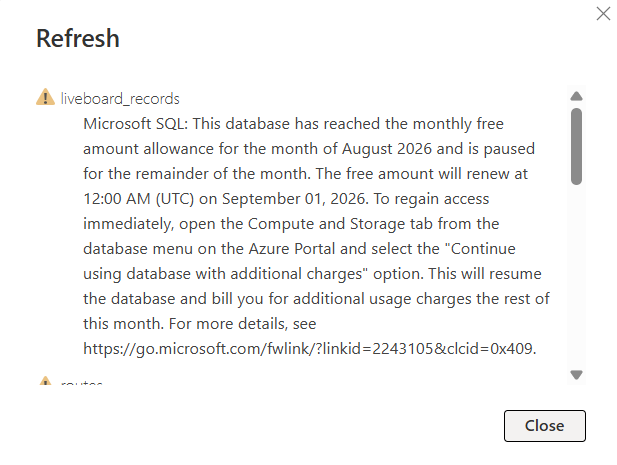

# RailPulse AI Assistant: Generative AI Public Transit Interface

[](https://www.python.org/)
[](https://railpulse-chat.streamlit.app/)
[](https://groq.com/)
[](https://azure.microsoft.com/)
[](https://www.sqlalchemy.org/)

[](https://becode.org/)

<p align="center">
  
</p>

<p align="center">
  <a href="https://railpulse-chat.streamlit.app/" target="_blank">
    
  </a>
</p>

RailPulse AI Assistant is an interactive Natural Language to SQL (NL2SQL) conversational interface designed for querying public transit data from the Belgian National Railway company (SNCB/NMBS). Built on a dual-stage LLM architecture powered by Llama 3.3 via Groq and connected directly to an Azure SQL Server cloud database, the assistant translates plain English or French questions into optimized dialect-aware SQL queries, executes them in real time, and synthesizes data-backed natural language responses.

* **Domain:** Generative AI, Public Transit Analytics & Conversational Data Interfaces
* **Execution Timeframe:** 5-Day Sprint (Learning Challenge)
* **Development Type:** Solo Project (BeCode AI & Data Science Bootcamp)

---

## Architecture & System Data Flow

```text
        +-----------------------+      HTTP POST      +-----------------------------------------+
        |                       |    (User Prompt)    |  llm_service.py                         |
        |  Streamlit UI         | ------------------> |  - System Prompt with Dynamic Schema    |
        |  (streamlit_RP_app)   |                     |  - Text-to-SQL (Llama 3.3 70B / Groq)   |
        |  - Chat State Mgmt    |                     +-----------------------------------------+
        |  - Custom CSS & Logo  |                                          |
        |  - UI Data Table      | <----------------------------------------+
        +-----------------------+              SQL Query Output
                |                                                       |
                | Execute Query                                         v
                |                                   +-----------------------------------------+
                +---------------------------------> |  db_service.py                          |
                                                    |  - Cold-Start Retry Logic               |
                                                    |  - Dynamic Schema & Dialect Inspector   |
                                                    |  - SQLAlchemy / Azure SQL (pyodbc)      |
                                                    +-----------------------------------------+
                                                                        |
                                                                        v
                                                    +-----------------------------------------+
                                                    |  Azure SQL Database                     |
                                                    |  - GTFS Static Tables (stops, routes...)|
                                                    |  - Real-Time Liveboard Records          |
                                                    +-----------------------------------------+
```
### System Workflow
1. **User Request & History:** The user enters a question in the Streamlit frontend. The full conversation history is captured to maintain multi-turn dialogue context.
2. **Schema & Dialect Inspection:** `db_service.py` dynamically inspects the database to retrieve the active schema, column types, and engine dialect (`T-SQL / Azure SQL` or `SQLite`).
3. **NL2SQL Query Generation:** `llm_service.py` passes the database schema, query performance guidelines, and conversation history to `llama-3.3-70b-versatile` via Groq API to generate an executable T-SQL query.
4. **Execution & Cold-Start Recovery:** `db_service.py` executes the read-only SQL query against Azure SQL. If the serverless cloud instance is waking up from pause, built-in retry logic handles the connection handshake seamlessly.
5. **Answer Synthesis:** The output DataFrame is formatted and sent to a second LLM completion step to generate a concise English summary, rendered alongside the raw data table in Streamlit.

---

## Technical Implementation & Core Code Logic

### 1. Data Enrichment & Cross-Sprint Ecosystem Integration
* **Cross-Sprint Data Evolution:** In earlier project sprints (e.g., Power BI analytics), Azure SQL hosted real-time delay records alongside only a minimal subset of static GTFS lookup tables, while the full static GTFS database remained stored locally.
* **Full Cloud Ingestion for NL2SQL:** To enable the GenAI chatbot to answer natural language questions about complete train schedules, trip itineraries, and station routes, the complete static GTFS dataset (`stops`, `routes`, `trips`, `stop_times`, `calendar`) was migrated from the local environment to the cloud Azure SQL Database via a dedicated ETL pipeline.
* **Unified Query Domain:** Housing the full static schema in the same cloud database as the live dynamic records allows the LLM to construct complex, multi-table T-SQL `JOIN`s—seamlessly bridging static timetable metadata with dynamic transit telemetry under one unified database architecture.

### 1. Dynamic Database Engine & Resilience (`db_service.py`)
* **Universal Schema Inspection:** Uses `sqlalchemy.inspect` to automatically detect tables and column types at runtime. This eliminates hardcoded schema strings and ensures that any new table added to Azure SQL is immediately queryable by the LLM without code updates.
* **Cold Start Retry Logic:** Serverless Azure SQL instances enter a paused state after inactivity. `_get_engine()` implements an exponential backoff loop (3 retries with 15-second delays) to handle `OperationalError` exceptions gracefully during cold starts.
* **Safe Query Execution:** Wraps generated queries with `sqlalchemy.text()` to execute read-only queries securely into Pandas DataFrames.

### 2. Dual-Stage LLM Pipeline & Failover (`llm_service.py`)
* **Dialect-Aware Text-to-SQL:** Custom system prompts instruct the LLM to generate optimized T-SQL queries using specific Common Table Expressions (CTEs) for date filtering (`day_services`) and station matching (`station_ids`).
* **Belgian Transit French Mapping:** Pre-configured station alias mappings ensure accurate matches for Belgian railway locations (e.g., *"Antwerp"* $\rightarrow$ `LIKE '%anvers%'`, *"Ghent"* $\rightarrow$ `LIKE '%gand%'`).
* **Rate-Limit Fallback:** Implements automatic fallback logic: if the primary 70B model hits Groq rate limits (HTTP 429), execution instantly switches to `llama-3.1-8b-instant`.

### 3. Streamlit Interface & State Management (`streamlit_RP_app.py`)
* **Performance Caching:** `@st.cache_data` caches database schema extraction to prevent unnecessary database queries on UI refreshes.
* **Custom UI:** Embedded Base64 image encoding renders dark-mode styled brand logos (`RailPulse_logo.png` and `SNCB_logo.svg.webp`) with persistent header alignment.

---

## Data Availability & Note on Azure SQL Pause

<p align="center">
  
</p>

> **Database Status Notice:**  
> The upstream live Azure SQL Database reached its monthly free allowance limit during August 2026, temporarily pausing live data ingestion.
> 
> * **Current Operational Behavior:** The assistant currently queries static GTFS schedules, stops, routes, and operational records up to **August 16, 2026**.
> * **Real-Time Data Resumption:** Starting **September 01, 2026**, when the Azure quota resets, real-time liveboard ingestion will resume. Thanks to the dynamic schema and query execution engine in `db_service.py`, the assistant will automatically process live dynamic train delay records without requiring any code updates or redeployments.

---

## 📁 Repository Structure

```text
railpulse-genai-challenge/
├── assets/                             # Brand logos and documentation media
│   ├── RailPulse_logo.png              # Main RailPulse brand logo
│   ├── SNCB_logo.svg.webp              # SNCB partner logo
│   └── live_data_paused.png            # Azure DB limit notification screenshot
├── tests/                              # Isolated test scripts for features
│   ├── check_db.py                     
│   ├── check_names_in_db.py 
│   ├── debug_chatbot_performance.py
│   └── test_db_service.py
├── .gitignore                          # Environment & cache exclusion rules
├── README.md                           # Project documentation
├── db_service.py                       # Database connection, retry logic & dynamic schema inspector
├── llm_service.py                      # Groq LLM integration, Text-to-SQL & answer synthesizer
├── requirements.txt                    # Explicit Python dependencies
└── streamlit_RP_app.py                 # Main Streamlit chat UI application
```

---

## Local Setup & Deployment

### 1. Clone Repository
```bash
git clone [https://github.com/ireneghioni-glitch/railpulse-genai-challenge.git](https://github.com/ireneghioni-glitch/railpulse-genai-challenge.git)
cd railpulse-genai-challenge
```

### 2. Configure Environment Variables
Create a `.env` file in the root directory (or configure via **Streamlit Secrets** for cloud deployment):

```env
DATABASE_CONNECTION_STRING="mssql+pyodbc://<USER>:<PASSWORD>@<SERVER>.database.windows.net:1433/<DB_NAME>?driver=ODBC+Driver+18+for+SQL+Server"
LLM_API_KEY="your_groq_api_key_here"
LLM_BASE_URL="[https://api.groq.com/openai/v1](https://api.groq.com/openai/v1)"
LLM_MODEL="llama-3.3-70b-versatile"
BACKUP_LLM_MODEL="llama-3.1-8b-instant"
```

### 3. Install Dependencies & Launch App
```bash
# Install dependencies
pip install -r requirements.txt

# Launch Streamlit frontend
streamlit run streamlit_RP_app.py
```

<br>

<br>

---

<br>

## Author

**Irene Ghioni**  
[AI & Data Science](https://becode.org/en/job-seekers/trainings/ai-data-science) Trainee at [BeCode Belgium](https://becode.org/) *(Specializing in Data Science)*  

[](https://www.linkedin.com/in/ireneghioni/) [](https://github.com/ireneghioni-glitch)